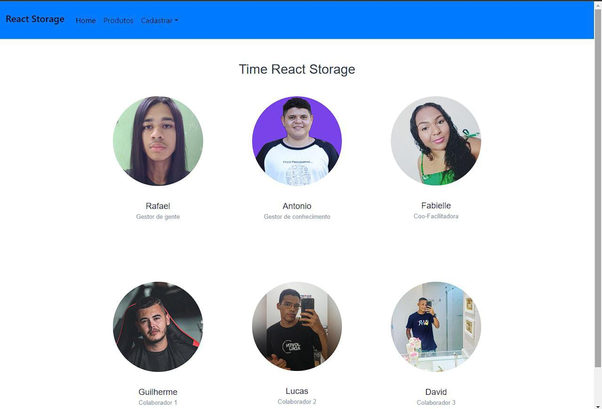

<h1>Projeto em Grupo do Módulo 3 do Curso de Desenvolvimento Web FullStack Resília.3</h1>
    <h1>🔵Sobre o projeto🔵</h1>
    <h2>#Hard skills</h2>
    
O objetivo era criar o site tematico usando como base inicial um projeto individual.

    <h2>#Soft skills</h2>
    
React Storage é um sistema de estoque virtual construído para auxiliar lojas de departamentos no controle de entrada e saída de produtos.

   <h2>#Linguagens e Ferramentas</h2>
   
⚫Html5

   
🟤Css3

   
🟠Javascript

   
🟣React

   
   <h2>#Colaboradores</h2>
   
   
   <h2>#Paginas de Cadastramento</h2>
   
   
   
   <h2>#Pagina de Produto</h2>
   
   
